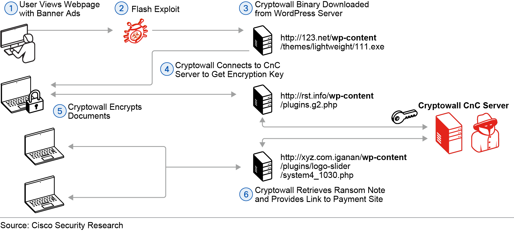
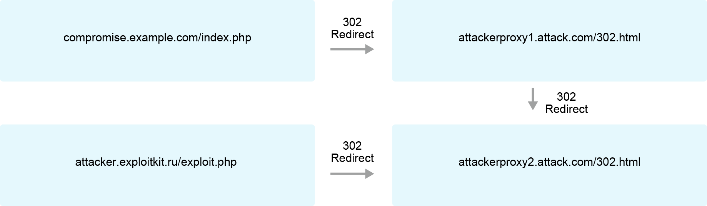
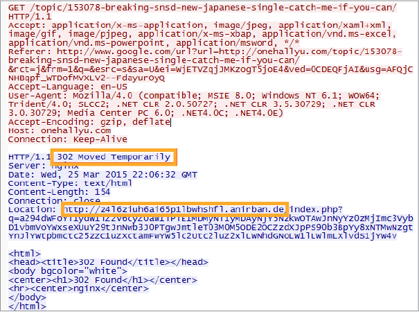

# Describe Common Network Application Attacks

## Password Attacks

    Some methods used to obtain passwords. 
    - Password guessing
    - Brute-force attacks
    - Dictionary Attacks
    - Phishing Attacks
    
    Some common password attack tools that are openly available include: Cain and Abel, John the Ripper, OphCrack, and L0phtCrack.

    A common approach to reducing the risk of password brute-force attacks is to lock the account or increase the delay between login attempts when there have been repeated failures. This can be effective in slowing down brute-force attacks and giving the incident response team time to react.

    Another countermeasure against password attacks is two-factor authentication.

## DNS-Based Attacks

## DNS Tunnelling

    DNS tunneling is where another protocol or data is hidden in the DNS packets. Typically, attackers will use DNS tunneling for stealthy data exfiltration in a data breach or for the CnC traffic communications.

    Two of the common encoding methods include Base32 and Base64 encoding:

    - Tunneling non-DNS data within DNS traffic abuses both the DNS protocol and its records. Every type of DNS record (for instance, NULL, TXT, SRV, MX, CNAME, or A) can be used, and the speed of the communications is determined by the amount of data that can be stored in a single record of each type. TXT records can store the most data and are typically used in DNS tunnel implementations. However, it is not as common to frequently request this type of DNS record, so it may be more easily detected
    - The outbound phase starts by splitting the desired data on the local host into many encoded data chunks. Each data chunk (for example, 10101) is placed in the third- or lower-level domain name label of a DNS query (for example, 10101.cnc.tld). There will be no cached response on the local or network DNS server for this query. Therefore, the query is forwarded to the ISP’s recursive DNS servers.
    - The recursive DNS service that is used by the network will then forward the query to the cybercriminal’s authoritative name server. This process is repeated using multiple DNS queries depending on the number of data chunks to send out.
    - The inbound phase is triggered when the cybercriminal’s authoritative name server receives DNS queries from the infected device. It may send responses for each DNS query, which encapsulates encoded commands. The malware on the infected device recombines these fragmented commands and executes them.
    - Alternatively, if two-way communication is not necessary, either the queries or responses can exclude the encapsulated data or commands, making it more inconspicuous to avoid detection.

    Countermeasures to attacks that are based on DNS tunneling include the following:
    - Monitor the DNS log for suspicious activities such as DNS queries with unusually long and suspicious domain names.
    - Deploy a solution such as Cisco Umbrella to block the DNS tunneling traffic from going out to the malicious domains.

## Web-Based Attacks

    The figure shows how attackers use WordPress servers as their ransomware infrastructure.

    Countermeasures to web-based attacks include the following:
    - To help defend against today's web-based attacks, web application developers must follow best security practices in developing their web applications, for example, referencing the best practices recommended by Open Web Application Security Project (OWASP).
    - Keep the operating system and web browser versions up-to-date.
    - Deploy services such as Cisco Umbrella to block the users from accessing malicious websites.
    - Deploy a web proxy security solution, such as the Cisco Web Security Appliance, to block users from accessing malicious websites.
    - Educate end users on how web-based attacks occur.

## HTTP 302 Cushioning

    A website can change the path that is used to reach a resource by issuing an HTTP redirect to direct the user's web browser to the new location. The 302 Found HTTP response status code can be used for this purpose. The HTTP response status code 302 Found is a common way of performing URL redirection. Attackers often use legitimate HTTP functions, such as HTTP redirects, to carry out their attacks. 

    An HTTP response with the 302 Found status code will also provide a URL in the location header field. The browser interprets the 302 HTTP response status code to mean that the requested resource has been temporarily relocated to the new location provided in the response. The browser is invited to make an identical request to the new URL that is specified in the location field. The HTTP/1.0 specification (RFC 1945) gives the 302 HTTP response status code the description "Moved Temporarily."

    The figure illustrates an example where an attacker has compromised a legitimate website (example.com), causing the website to respond to the victim's HTTP request to compromise.example.com/index.php with the 302 Found HTTP response status code. This creates a series of HTTP 302 redirects through the attacker's proxies before the victim's browser is finally redirected to the attacker's web page that spreads the malicious exploit to the victim.

    

    The figure shows a partial Wireshark output, which illustrates the HTTP 302 response where a compromised website is used to redirect the victim.
    

    Countermeasures to attacks using HTTP 302 cushioning include the following:
    - Use a service such as Cisco Umbrella to block the users from accessing malicious web sites.
    - Deploy a web proxy security solution, such as the Cisco Web Security Appliance (WSA) to block users from accessing malicious web sites.
    - Educate end users on how the browser is redirected to a malicious web page that delivers the exploit to the victim's machine through a series of HTTP 302 redirections.

## Command Injections

## SQL-Site Scripting and Request Forgery

## Email-Based Attacks

